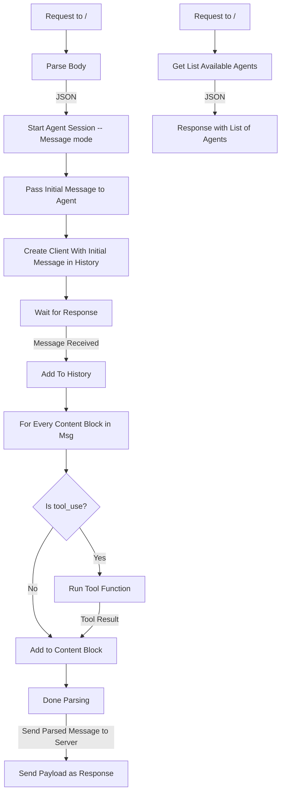
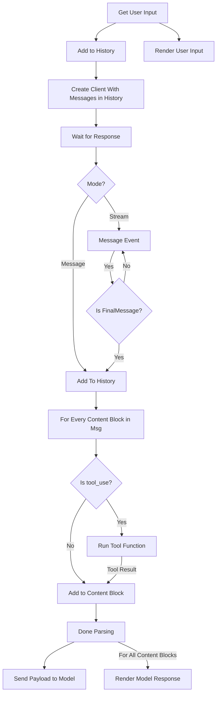

## Server Lifecycle

```mermaid
flowchart TD


POST[Request to /] --> POST2[Parse Body]
POST2 --> |JSON| POST3[Start Agent Session -- Message mode]
POST3 --> POST4[Pass Initial Message to Agent]
POST4 --> C[Create Client With Initial Message in History]
C --> D[Wait for Response]
E[For Every Content Block in Msg]
E1[Add To History]
D --> |Message Received| E1
E1 --> E
E --> F{Is tool_use?}
F --> |Yes| G[Run Tool Function]
F --> |No| I
G --> |Tool Result| I[Add to Content Block]
I --> I1[Done Parsing]
I1 --> |Send Parsed Message to Server| J[Send Payload as Response]


GET[Request to /] --> Agent[Get List Available Agents]
Agent --> |JSON| GET2[Response with List of Agents]


```

## CLI Lifecycle

```mermaid

flowchart TD

A[Get User Input] --> B[Add to History]
A --> B1[Render User Input]
B --> C[Create Client With Messages in History]
C --> D[Wait for Response]
D --> D1{Mode?}
E[For Every Content Block in Msg]
E1[Add To History]
D1 --> |Message| E1
E1 --> E
D1 --> |Stream| S[Message Event]
S --> |Yes| S2{Is FinalMessage?}
S2 --> |Yes| E1
S2 --> |No| S
E --> F{Is tool_use?}
F --> |Yes| G[Run Tool Function]
F --> |No| I
G --> |Tool Result| I[Add to Content Block]
I --> I1[Done Parsing]
I1 --> J[Send Payload to Model]
I1 --> |For All Content Blocks| H[Render Model Response]
```

sk-imagine-an-api-key-here
